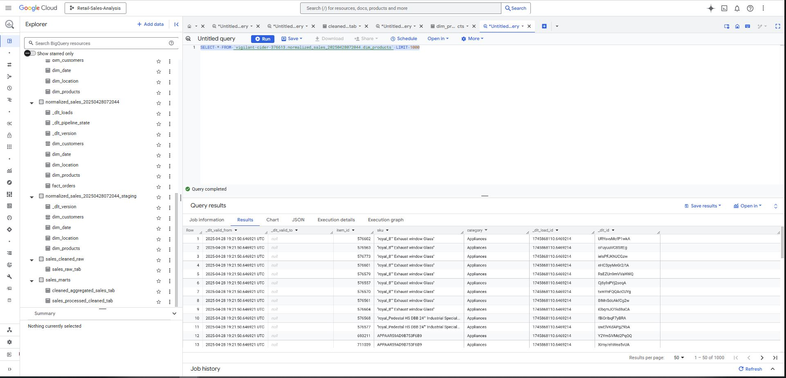
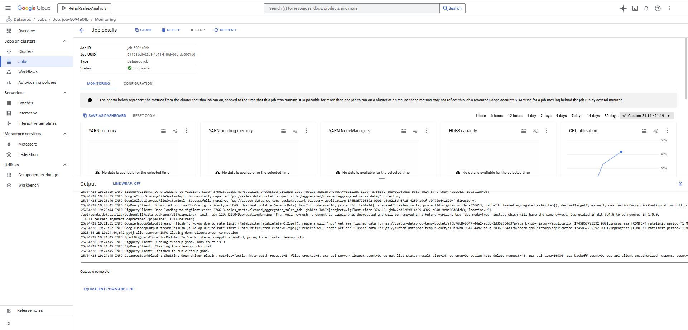
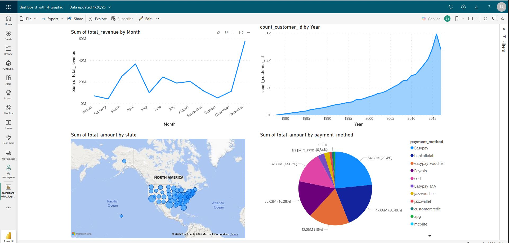
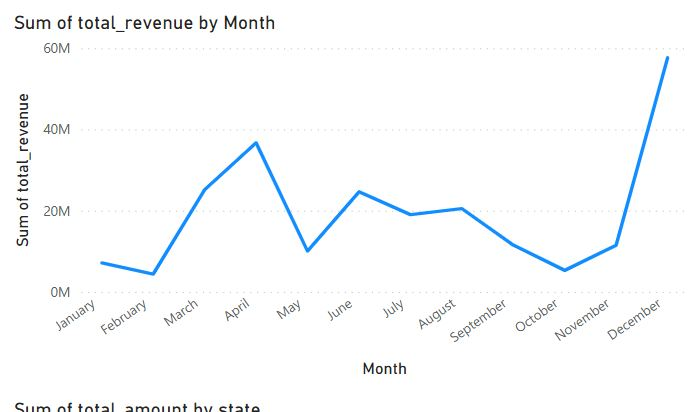
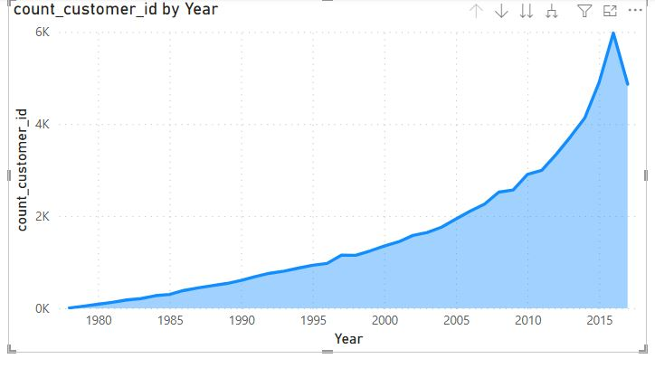
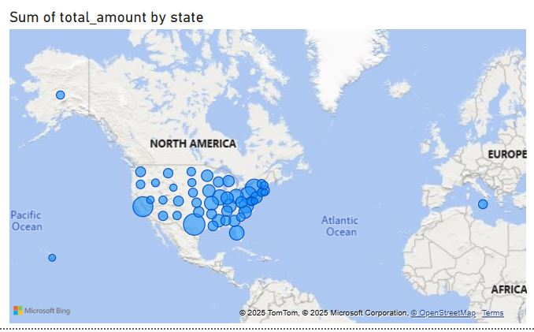
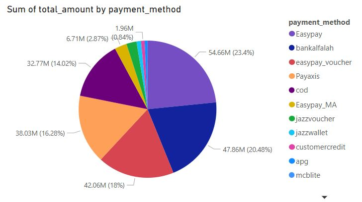

---

# Sales Analysis – Data Engineering Pipeline

## Project Description & Data Overview
This project implements an end-to-end data engineering pipeline for **sales analysis** using modern tools like Google Cloud Storage, BigQuery, Dataproc, Terraform, DLT, dbt, Airflow, Docker, and Power BI. The first step involves provisioning the Google Cloud infrastructure using Terraform and staging all necessary artifacts.

# Overview

The pipeline’s infrastructure comprises:

- **Google Cloud Storage Buckets:**
  - **Staging Bucket:** For storing initialization scripts, PySpark jobs, and other artifacts needed by Dataproc at creation time.
  - **Temporary Bucket:** Used by Dataproc for shuffle and scratch storage during job execution.

- **BigQuery Datasets:** Two separate datasets:
  - One for raw/cleaned data (`sales_cleaned_raw`)
  - One for transformed data (`sales_marts`)

- **Dataproc Cluster:** A single-node cluster (with auto-deletion) configured for data cleaning and preprocessing.

- **IAM Role Assignments:** A dedicated service account, whose email is dynamically extracted from the provided credentials file, is used for deploying and managing resources. The service account is granted minimal—but sufficient—permissions:
  - **Dataproc Management:** `roles/dataproc.editor`
  - **Storage Management:** `roles/storage.admin` and `roles/storage.objectAdmin`
  - **BigQuery Management:** `roles/bigquery.dataEditor`
  - **Compute Management:** `roles/compute.instanceAdmin`
  - **IAM Policy Management:** `roles/iam.securityAdmin` and `roles/iam.serviceAccountUser`

**Data Source:**  
- We use a publicly available sample sales dataset (e.g. from Kaggle) covering fiscal year 2020–2021.  
- Contains order-level records: `order_id`, `order_date`, `customer_id`, `product_id`, `quantity`, `price`, `region`, etc.  
- Approximately ~300,000 rows, with both transactional and dimensional attributes.

---

# Step 1: Provision Infrastructure with Terraform

Terraform is used to set up all necessary GCP components:

1. **Provider and Service Account Extraction**
   - Reads your service account credentials from a JSON file.
   - Dynamically extracts the `client_email` so you don’t hardcode your service account.

2. **Resource Provisioning**
   - **Staging & Temp Buckets:** Creates two GCS buckets for Dataproc staging and temporary storage (`force_destroy = true`).
   - **Initialization Script Upload:** Uploads `initialization_action.sh` from the local `scripts/` folder into the staging bucket via a `google_storage_bucket_object` resource.
   - **BigQuery Datasets:** Provisions two datasets for raw and transformed data.
   - **Dataproc Cluster:** Spins up a single-node cluster with:
     - Custom staging and temp buckets.
     - Idle deletion TTL to auto-delete after inactivity.
     - Software config enabling JUPYTER.
     - Initialization action pointing at `gs://<staging_bucket>/initialization_action.sh`.

3. **IAM Role Assignments**
   - A Terraform module assigns all necessary roles to the service account, including `storage.objectAdmin` which is required for Dataproc to access custom buckets.

## Terraform Snippet: Upload Init Script

```hcl
resource "google_storage_bucket" "dataproc_staging_bucket" {
  name          = var.dataproc_staging_bucket
  location      = var.region
  force_destroy = true
}

resource "google_storage_bucket" "dataproc_temp_bucket" {
  name          = var.dataproc_temp_bucket
  location      = var.region
  force_destroy = true
}

resource "google_storage_bucket_object" "init_script" {
  bucket       = google_storage_bucket.dataproc_staging_bucket.name
  name         = "initialization_action.sh"
  source       = "${path.module}/../scripts/initialization_action.sh"
  content_type = "application/x-sh"
}
```

To run Terraform Script:

```bash
terraform -chdir=terraform/ init
terraform -chdir=terraform/ plan
terraform -chdir=terraform/ apply
```

---

## Step 2: Download and Upload Sales Data to GCS

After provisioning, ingest raw sales data into the staging bucket. A Bash script automates:

1. **Download Dataset:** Fetches the latest sample sales dataset from Kaggle with `curl`.  
2. **Unzip & Extract:** Extracts the CSV.  
3. **Upload to GCS:** Uses `gsutil` to upload the CSV to `gs://<sales_data_bucket>/raw/`.  
4. **Upload PySpark Script:** Uploads `Sales_Data_Cleaning_And_Aggregation.py` to `gs://<sales_data_bucket>/code/`.  

```bash
chmod +x scripts/download_and_upload.sh
./scripts/download_and_upload.sh

```bash
chmod +x scripts/download_and_upload.sh
./scripts/download_and_upload.sh
```

---

## Step 3: Run Cleaning & Aggregation Job on Dataproc

Submit a PySpark job that cleans and aggregates raw data:

```bash
gcloud dataproc jobs submit pyspark \
    --cluster=sales-cleaning-cluster \
    --region=${var.region} \
    gs://${var.dataproc_staging_bucket}/code/Sales_Data_Cleaning_And_Aggregation.py \
    -- \
      --input_path=gs://${var.dataproc_staging_bucket}/raw/sales.csv \
      --output_raw_bq=${var.bq_raw_dataset}.sales_raw_tab \
      --output_parquet=gs://${var.dataproc_staging_bucket}/processed/cleaned_sales_data \
      --output_bq=${var.bq_marts_dataset}.sales_processed_cleaned_tab \
      --output_agg_parquet=gs://${var.dataproc_staging_bucket}/aggregated/cleaned_aggregated_sales_data \
      --output_agg_bq=${var.bq_marts_dataset}.cleaned_aggregated_sales_tab
```
- Flags Explained:

   - `--input_path`: GCS location of raw CSV

   - `--output_raw_bq`: BigQuery table for cleaned raw data

   - `--output_parquet`: GCS path for cleaned Parquet files

   - `--output_bq`: BigQuery table for cleaned data

   - `--output_agg_parquet`: GCS path for aggregated metrics

   - `--output_agg_bq`: BigQuery table for aggregated metrics

## What this Script Does

- Loads raw CSV from GCS  
- Writes raw data to BigQuery  
- Deduplicates & cleans rows (drops nulls, trims spaces)  
- Casts fields to proper types and renames columns  
- Validates totals vs. computed values  
- Normalizes strings and uppercases states  
- Writes cleaned data to Parquet in GCS and to BigQuery  
- Aggregates monthly metrics (revenue, average quantity, orders)  
- Writes aggregated results to Parquet and BigQuery  

<p align="center">
  
</p>

---

## Step 4: DLT Pipeline (Data Load Tool)

We use Databricks DLT to build a managed data pipeline that:

1. Defines incremental sources from the cleaned BigQuery table  
2. Implements SCD Type 2 for `dim_customers` and `dim_products`  
3. Builds additional dimensions: `dim_location`, `dim_date`, and `fact_orders`  
4. Runs the DLT pipeline to merge and append data into a unified `normalized_sales` dataset in BigQuery  

```python
pipeline = dlt.pipeline(
    pipeline_name="sales_dlt_to_bq",
    destination="bigquery",
    dataset_name="normalized_sales",
    full_refresh=True
)
# ... resource definitions ...
pipeline.run(...)
```
<p align="center">
  
</p>
---

## Step 5: Orchestration with Airflow & Docker

All steps (Terraform, data ingestion, Dataproc job, DLT pipeline, and Power BI refresh) are orchestrated in an Airflow DAG, containerized via Docker:

- **Docker:** Each component runs in its own container:
  - Terraform runner  
  - Bash ingestion script  
  - GCloud Python SDK for job submission  
  - DLT runner  
  - Airflow scheduler & workers  

- **Airflow DAG:** Defines tasks and dependencies:
  1. `provision_infra`  
  2. `ingest_raw_data`  
  3. `run_dataproc_cleaning_job`  
  4. `execute_dlt_pipeline`  
  5. `generate_powerbi_dataset`  

---
## Step 6: Dashboard in Power BI

Finally, connect Power BI to the `normalized_sales` BigQuery dataset to build interactive dashboards:

- Monthly Revenue & Orders trend charts  
- Category & Payment Method filters  
- Customer Demographics dimension visuals  
- Geographical maps by state and region  

<p align="center">
  
</p>

<p align="center">
  
</p>

<p align="center">
  
</p>

<p align="center">
  
</p>

<p align="center">
  
</p>

---

### Next Steps

- Add **dbt** transformations for additional business logic  
- Implement CI/CD for Terraform and Airflow  
- Automate Power BI dataflow refresh via the Power BI REST API  

